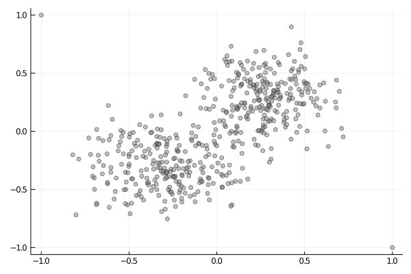
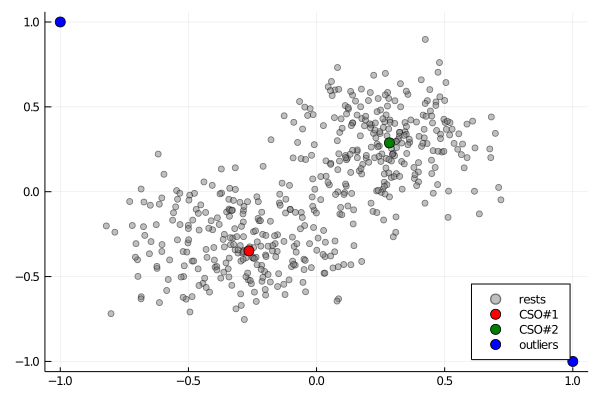
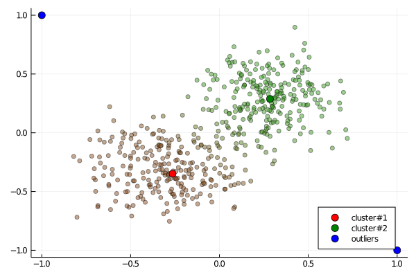

# FLAME

[](https://codecov.io/gh/ymtoo/FLAME.jl)

This package implements [Fuzzy clustering by Local Approximation of MEmberships (FLAME)](https://link.springer.com/article/10.1186/1471-2105-8-3).

## Usage
```julia
using Colors, FLAME, Plots

numdata1 = 249
numdata2 = 249
data1 = 0.2 .* randn(2, numdata1) .- 0.3
data2 = 0.2 .* randn(2, numdata2) .+ 0.3
outliers = [-1.0 1.0; 1.0 -1.0]
data = [data1 data2 outliers]

scatter(data[1,:], data[2,:]; color=:gray, legend=false, markeralpha=0.5)
```


```julia
k = 100
threshold = 2.0
idxs, dists = FLAME._knn(data, k)
csos, outliers, rests = extractstructure(idxs, dists; threshold=threshold)

p = plot()
colors = [:red, :green]
scatter!(p, data[1,rests], data[2,rests]; label="rests", color=:gray, legend=:bottomright, markeralpha=0.5)
for (i, cso) in enumerate(csos)
    scatter!(p, data[1,[cso]], data[2,[cso]]; labels="CSO#$(i)", color=colors[i], legend=:bottomright, markersize=6)
end
scatter!(p, data[1,outliers], data[2,outliers]; label="outliers", color=:blue,legend=:bottomright, markersize=6)
```


```julia
res = flame(data, k; threshold=threshold, display=:iter)
p = plot()
colors = [:red, :green]
colorvec = [RGB(rgb[1], rgb[2], rgb[3]) for rgb in eachrow(res.memberships[rests,:])]
scatter!(p, data[1,rests], data[2,rests]; label="", color=colorvec, markeralpha=0.5)
for (i, cso) in enumerate(csos)
    scatter!(p, data[1,[cso]], data[2,[cso]]; label="cluster#$(i)", color=colors[i], legend=:bottomright, markersize=6)
end
scatter!(p, data[1,outliers], data[2,outliers]; label="outliers", color=:blue,legend=:bottomright, markersize=6)
```
